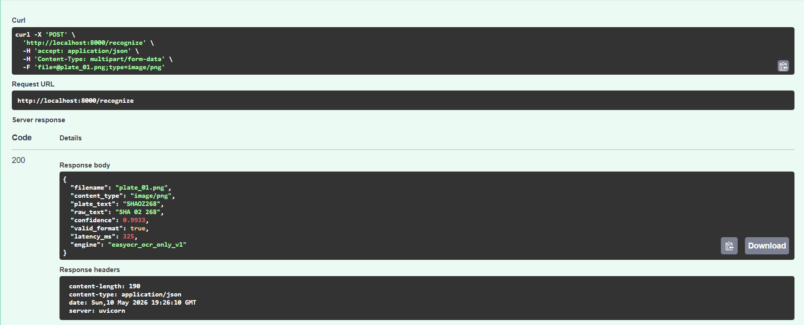
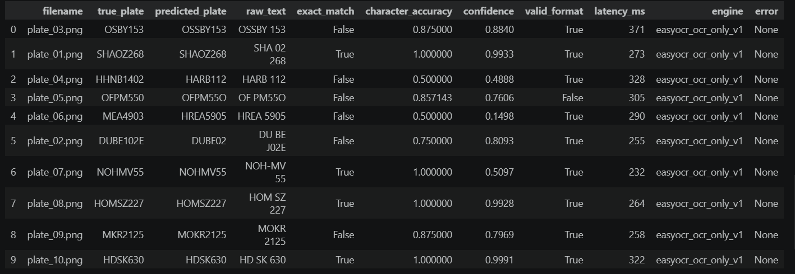
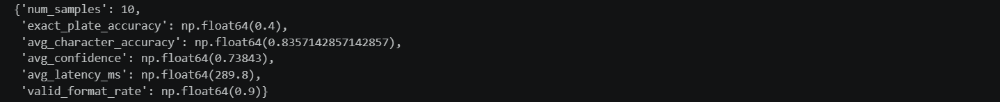

# ANPR-evalsys
A prototype for evaluating license plate recognition engines.

## Architecture
Image -> Detection -> Crop -> Preprocessing -> OCR -> Postprocessing -> Result API

## API Endpoints
- `POST /recognize`: Accepts an uploaded image and returns the evaluation results.

Example via OpenAPI docs:

## Metrics
- Exact plate accuracy
- Character accuracy
- Latency
- Detection success rate

Current evaluation results on the 10 test images:

## Dataset
- Germany License Plate Dataset: Preview
https://www.kaggle.com/datasets/unidpro/germany-license-plate-dataset?resource=download

## Stack 
- Python
- FastAPI
- OpenCV
- EasyOCR
- YOLO
- PostgreSQL
- Docker
- pytest